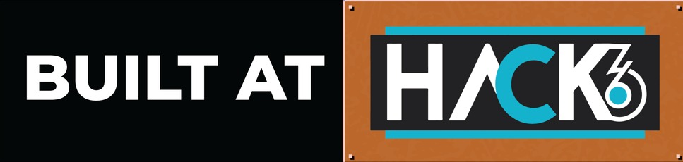
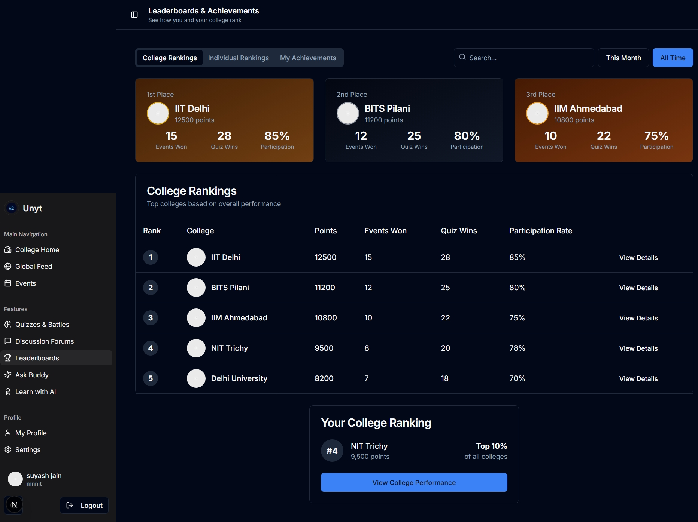
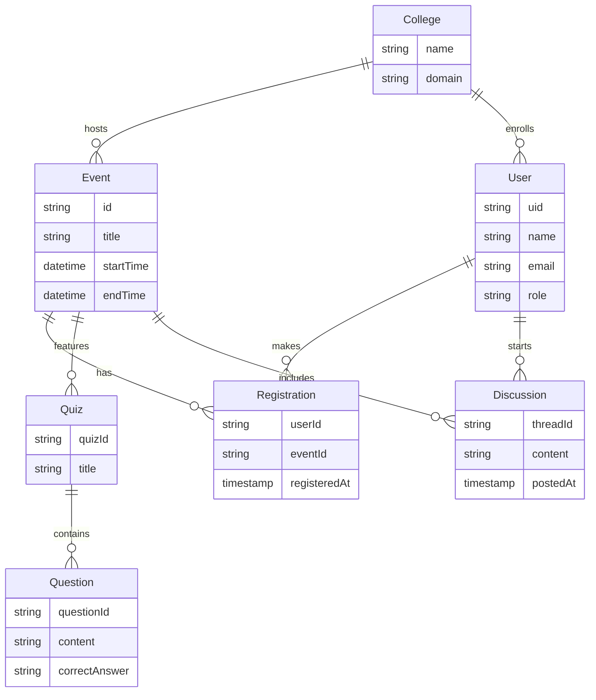
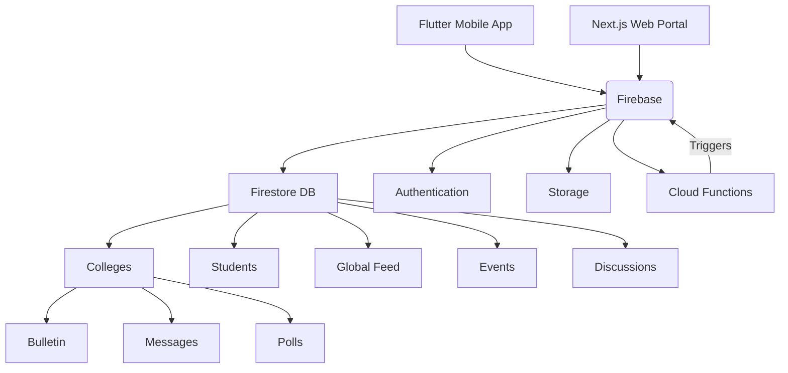
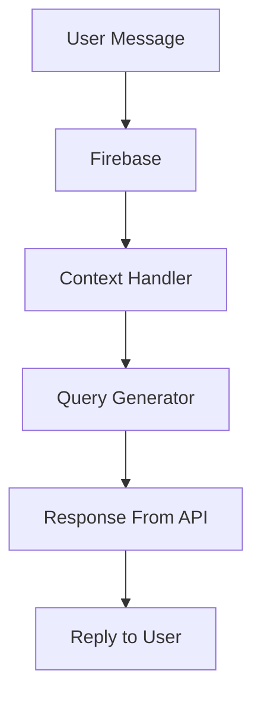
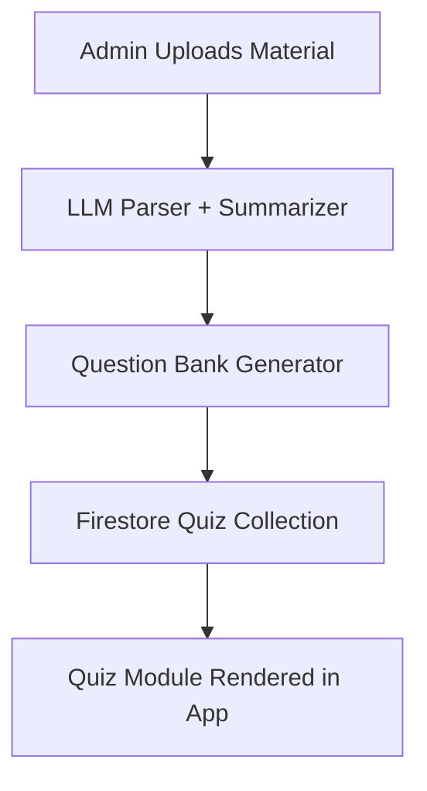
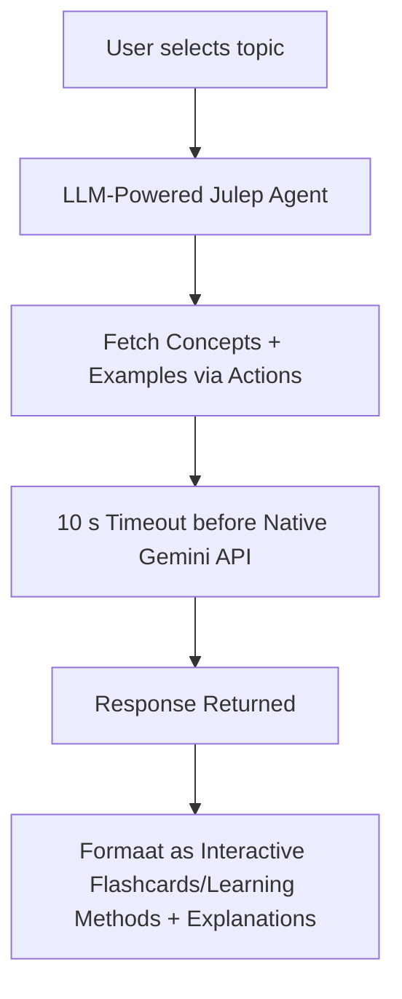

# 📱 Unyt – Bridging Colleges, Building Communities
<div style="position: absolute; top: 0; right: 0;">
  
</div>
A unified app-ecosystem for inter-college collaboration, announcements, events, quizzes, and more. Built using Flutter (Mobile) and Next.js (Web) with Firebase as the backend.

---
## 📹 Demo Video
Watch Here: [Demo Video](https://youtu.be/ECsMwjBcfP8?si=J7YJOLSgtgllj8uL)

## Presentation
Link: [Unyt Presentation](https://drive.google.com/drive/folders/1MBxVWiNqDM66BjjmyKTZvjNiYWHc89Cj?usp=sharing)

## 🧽 Table of Contents
- [🚀 Overview](#-overview)
- [📸 UI & Visuals](#-ui--visuals)
- [🗃️ Database Schema](#️-database-schema)
- [🏗️ Architecture](#️-architecture)
- [🧰 Tech Stack](#-tech-stack)
- [📦 Setup](#-setup)
- [🤝 Contributing](#-contributing)
- [📄 License](#-license)

---

## 🚀 Overview

Unyt is a cross-platform platform aiming to connect college students through a centralized app and web system. With personalized homepages, discussion forums, quiz battles, and a leaderboard system, Unyt enhances student collaboration beyond campus boundaries.

---

## 📸 UI & Visuals

### 🔹 Web Interface


### 🔹 Mobile App (Flutter)
<p float="left">


</p>

---

## Features

### 📱 Mobile App (Flutter)
- College-specific home, global feed, and event discovery
- Forums and discussions for student engagement
- Quizzes and battles for learning and competition
- Leaderboards for colleges, students, and quizzes
- Profile management and achievements
- Notifications, analytics, and Firebase integration

### 🌐 Website (Next.js)
- Landing page and onboarding
- College dashboard: bulletins, events, notices
- Forums and topic discussions
- Quiz and battle rooms
- Leaderboards and achievements
- Profile and settings management
- Modern, responsive UI with Tailwind CSS

--- 

## 🗃️ Database Schema

### 🔸 Firebase Firestore Schema


### 🔸 Entity-Relationship Diagram (ERD)

</details>

---

## 🏗️ Architecture

### 🔸 Tech Flow
- Mobile and Web apps interact with Firebase (Auth, Firestore, Storage)
- Cloud Functions for background operations
- Firestore triggers for event-driven features

### 📊 Mermaid Architecture Diagram

</details>

---

## 🧠 AI Workflows

### 🤖 Chatbot Assistant



### 🧠 Quiz Generator



### 📚 AI Learning Hub



---

## 🧰 Tech Stack

| Platform      | Tools & Frameworks                           |
|---------------|----------------------------------------------|
| Mobile App    | Flutter, Dart, Provider etc                  |
| Web Portal    | TypeScript, Next.js, Tailwind CSS, Vercel    |
| Backend       | Firebase Auth, Firestore                     |

---

## 📦 Setup

### 🔧 Mobile App (Flutter)
```bash
cd app
flutter pub get
flutter run
```

### 🔧 Web App (TypeScript)
```bash
cd website
pnpm i
pnpm run dev
```

---

## Contributing
Contributions are welcome! Please open issues and pull requests for improvements, bugfixes, or new features.

## Authors & Credits
Team Phoenix
Members - Shanu Kumawat, Revan Channa, Samudraneel Sarkar, Suyash Jain

